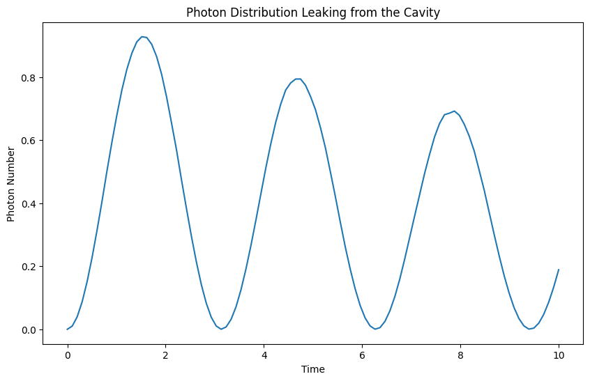

## Simulation of Photon Distribution and Atom-Cavity Dynamics in a Leaky Cavity with a Two-Level Atom

```python
import numpy as np
import matplotlib.pyplot as plt
from qutip import *

# Parameters
N = 10  # Number of cavity Fock states
kappa = 0.1 # Decay rate of the cavity
gamma = 0.05  # Decay rate of the atom
n_photons = 5  # Number of photons in the Fock state source
timesteps = 100  # Number of time steps
delta_t = 0.1  # Time step size

# Operators
a = tensor(destroy(N), qeye(2))  # Cavity annihilation operator
sigmap = tensor(qeye(N), create(2))  # Atomic excitation operator
sigmam = tensor(qeye(N), destroy(2))  # Atomic de-excitation operator

# Hamiltonian for the system
H_atom = 0.5 * gamma * sigmap * sigmam
H_cavity = 0.5 * kappa * (a.dag() * a)
H_coupling = sigmap * a.dag() + sigmam * a
H = H_atom + H_cavity + H_coupling

# Initial state
psi0 = tensor(basis(N, 0), basis(2, 0))

# Fock state source
source_state = fock(N, n_photons)

# Time evolution
tlist = np.linspace(0, timesteps * delta_t, timesteps)

# Define the collapse operators
c_ops = [np.sqrt(kappa) * a]

# Monte Carlo solver
output_states = mcsolve(H, psi0, tlist, c_ops, [a.dag() * a])

# Plotting photon distribution
plt.figure(figsize=(10, 6))
plt.plot(tlist, output_states.expect[0])
plt.title('Photon Distribution Leaking from the Cavity')
plt.xlabel('Time')
plt.ylabel('Photon Number')
plt.show()
```

With a two-level atom (qubit) connected to an optical cavity, this code mimics a quantum optical system. Because of the cavity's lossy nature, photons have a decay rate of 𝜅, which indicates how often they can escape. Additionally, the atom has a decay rate of 𝛾, which denotes spontaneous emission.

The main goal of the code is to investigate the distribution of photons that leak out of the cavity over time. Beginning with the cavity and atom in their ground states, the system changes as a result of the action of the Hamiltonian, which encompasses the decay processes as well as the interaction between the atom and cavity mode.

### Parameters and Definitions
1. N: Number of cavity Fock states (10 in this simulation).
2. kappa (𝜅): Decay rate of the cavity (0.1).
2. gamma (𝛾): Decay rate of the atom (0.05).
3. n_photons: Number of photons in the Fock state source (5).
4. timesteps: Number of time steps (100).
5. delta_t: Time step size (0.1).

### Operators and Hamiltonian
1. a: Cavity annihilation operator (`tensor(destroy(N), qeye(2))`).
2. sigmap: Atomic excitation operator (`tensor(qeye(N), create(2))`).
3. sigmam: Atomic de-excitation operator (`tensor(qeye(N), destroy(2))`).

### Construction of Hamiltonina `H`
- `H_atom`: Hamiltonian for the energy levels of atom (0.5 * gamma * sigmap * sigmam).
- `H_cavity`: Hamiltonian for the cavity's photon number (0.5 * kappa * (a.dag() * a)).
- `H_coupling`: Interaction Hamiltonian between the atom and the cavity mode (sigmap * a.dag() + sigmam * a).

With all these added together, the total Hamiltonian is given by: 

$H=H_{\text{atom}}+H_{\text{cavity}}+H_{\text{coupling}}$

- Initial State
`psi0`: Initial state of the system with the cavity and atom in their ground states (`tensor(basis(N, 0), basis(2, 0))`).

- Collapse Operators
Defined to account for the decay of the cavity mode (`c_ops = [np.sqrt(kappa) * a]`).


### Plot Analysis:


A leaky optical cavity's predicted photon count is plotted against time from an initial condition in which the cavity and a two-level atom (qubit) are both in their ground states. Both the interaction between the atom and the cavity as well as photon leakage from the cavity are included in the simulation.

- **oscillating Behavior**: Over time, the photon number in the figure clearly displays an oscillating pattern. This is a sign of Rabi oscillations, which arise from coherent energy transfer between the cavity mode and the atom. Between stages where the energy is primarily in the cavity and those where it is primarily in the atom, the system oscillates.

- **Decay Envelope**: Throughout the period displayed, the oscillations' amplitude essentially stays constant. This indicates that, in comparison to the Rabi oscillation period, the photon decay rate (𝜅) and the atom's decay rate (𝛾) are comparatively low. The absence of substantial damping suggests that within the simulation's time span, the energy dissipation processes are not prominent.

- **Photon Leakage**: The lowest points in the oscillations when the photon number approaches zero show that, despite the modest decay rates, photons do leak out of the cavity. This demonstrates that the decay mechanisms at work may almost completely empty the cavity of photons following a complete Rabi cycle.

- Dynamics of Photon Leakage: The decay rate, represented by 𝜅, illustrates the rate at which photons escape the cavity with time.
- Atom-Cavity Interaction: Terms describing the energy exchange between the cavity mode and the atom are included in the Hamiltonian.
- Monte Carlo Simulation: mcsolve provides a realistic simulation of the system's quantum dynamics, including stochastic quantum jumps.


​
