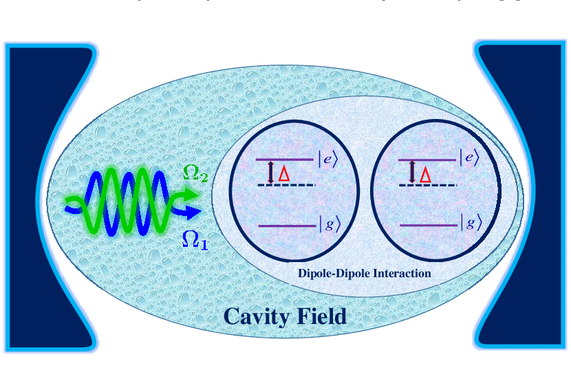
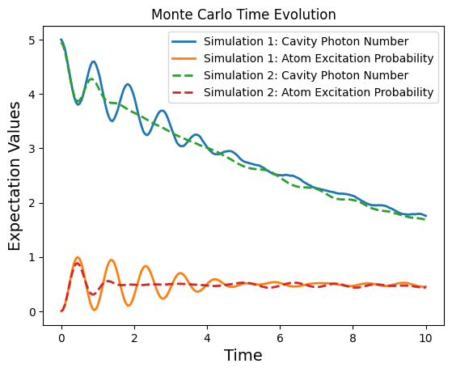

## Time Evolution and Quantum System Dynamics: Monte Carlo Solver with QuTip
Rather than a experimental practice, this project is solely based on theoretical arguments.` Monte Carlo` simulations are frequently used in quantum mechanics to investigate the dynamics of quantum systems with numerical approach, particularly in situations when obtaining precise analytical answers is challenging or impossible. `QuTiP` (Quantum Toolbox in Python) is a robust Python package which is used to simulate open quantum systems. It offers a range of functions for Monte Carlo simulations of quantum dynamics.

## "A two-level atom coupled to a leaky cavity"
A two-level atom coupled to a leaky cavity usually refers to a system in which an energy-leveled atom interacts with an electromagnetic field contained in a cavity that permits energy leakage. This situation is frequently examined within the framework of cavity quantum electrodynamics (QED), which examines the interaction between photons and atoms in cavities.

- The atom is basically described by a two-level quantum system.
- It has a ground state, let's say $\left| g \right\rangle$ and an excited state $\left| e \right\rangle$.
- While photons can be contained within the cavity, energy can also escape from it.

### Description:
Generally, Atoms have discrete energy levels, and a two-level atom refers to an atom with two relevant energy states: a ground state $\left| g \right\rangle$ and an excited state $\left| e \right\rangle$. Photons, usually in the optical or microwave frequency range, can be absorbed or emitted to trigger the transition between these two states[^1]. The system can absorb energy and change from the ground state to the "excited" state if the energy levels are not degenerate, or have unequal energies. An atom will periodically absorb photons from a coherent beam of light and reemit them through stimulated emission. A Rabi cycle is one such cycle, and the system's Rabi frequency is the inverse of its duration[^2]. The probability of finding the atom in the excited state is found from the Bloch equations to be:
 
 $(|c_{b}(t)|^{2} = \sin^{2}(\frac{\omega t}{2}))$,

 where ${\displaystyle \omega }$ is the Rabi frequency.

A cavity, is a confined space between two mirrors that can trap electromagnetic fields, such as photons, within it. These modes are quantized, meaning they can only have certain discrete frequencies and energies. A two-level atom's assymetric charge distribution inside its structure gives it an electric dipole moment.  The two-level atom interacts with the cavity mode via its electric dipole moment. There is a photon-based electromagnetic field inside the cavity. Because of the mirrors at either end, these photons are contained within the cavity and are able to oscillate. The atom gains energy and changes to its excited state as it receives a photon from the electromagnetic field. On the other hand, the atom loses energy and returns to its ground state when it emits a photon. Photons from the electromagnetic field are either absorbed or emitted by the atom as it moves between its excited and ground states. **The energies of the cavity mode (photons), atoms and the interactions, all are governed by the Hamiltonian describing the system.**
The Hamiltonian that describes the full system,

$H=H_{\text{field}}+H_{\text{atom}}+H_{\text{int}}$

consists of the cavity field Hamiltonian, the atomic excitation Hamiltonian, and the Jaynes–Cummings interaction Hamiltonian respectively[^3].


A cavity that is not completely sealed off from its surroundings is referred to as a **leaky cavity**. It causes dissipation and energy loss by allowing photons to leave the cavity. There are a number of ways that photons can leak into the surrounding area, including connection to external waveguides or faulty mirrors. The Hamiltonian of the Jaynes-Cummings interaction represents the coupling term. Their coupling strength determines the strength of the interaction between the cavity mode and the atom. This term plays a role in the energy exchange between two level systems (atoms) and bosonic (cavity mode photons)[^3].

###  Possible Observations:
**1. Decoherence:**
As a result of interactions with its surroundings, the quantum system loses its coherence, or capacity to retain superposition states(decoherence). In the case of an atom coupled to a leaky cavity, decoherence might result from the interaction of the atom-cavity system with external influences such as thermal fluctuations, photon leakage, or coupling to other degrees of freedom. Photons that leak out of the cavity or interact with external modes contain information about the atom-cavity system's quantum state. This causes a loss of phase information and coherence in the system[^4].

**2. Dissipation:**
Dissipation is the irreversible loss of energy from a quantum system to its environment. In the case of the atom-cavity system, dissipation is principally caused by photon leakage from the cavity into the surroundings. The leaky cavity allows photons to escape, reducing the energy stored in the cavity mode and increasing the entropy of the surroundings. Dissipation dampens coherent oscillations in the atom-cavity system, such as Rabi oscillations or coherent photon emission, which eventually leads to thermal equilibrium with the environment[^5].

**3. System-Environment Interactions:**
Photon leakage, temperature fluctuations, and coupling to external modes are some of the ways in which the atom-cavity system interacts with its environment.
These interactions can have a significant impact on the dynamics and stability of the system. For example, coupling to external modes can cause energy exchange and entanglement between the atom-cavity system and its surroundings.
System-environment interactions also influence the timeframes and efficiency of quantum processes as photon emission, absorption, and coherent control[^6].



<b><span style="font-size:larger">Figure 1:</span></b> <span style="font-size:larger">Schematic structure of two two-level atoms interacting with two coupled modes in an optical cavity in the presence of atomic dipole-dipole coupling[^7].</span>

### Method Employed: Monte Carlo Simulation
The Monte Carlo Simulation of **"a two-level atom coupled to a leaky cavity"** is carried out with `QuTip`. Monte Carlo method is based on the repeated random sampling to obtain numerical results. It employs randomness to solve stochastic problem and predict the probability. The process requires assigning multiple values to an uncertain variable to achieve multiple results and then averaging the results to obtain an estimate[^8].

### Monte Carlo Solver: mcsolve
MCSolve utilizes wavefunction simulations from Monte Carlo to solve quantum systems, enabling the study of stochastic processes and quantum jumps in open quantum systems with non-deterministic evolution. The quantum jump technique is a variation on the master-equation treatment that focuses on evolving the system's wave function rather than employing density matrix formalism. In this method, the system's wave function is evolved in time using a pseudo-Hamiltonian, with each time step potentially involving a quantum leap, which represents a discontinuous change. This generates quantum trajectories, which represent the system's state as a function of time. By averaging many simulated trajectories, the appropriate density matrix as a function of time can be calculated. In systems with a Hilbert space of size N, the number of wave function components equals N, and the number of density matrix components equals $N^2$[^9]. 

### Random Numbers Usage
`Random Numbers` are very crucial parts of this project, but instead of mannual generation, they are being internally developed by `mcsolve`. By selecting stochastic trajectories in accordance with the underlying quantum processes, `mcsolve` offers an approximate solution to the dynamics of the quantum system.

- Utilized to introduce probabilistic behavior into the simulation
- Represent quantum jumps, spontaneous emission
- QuTiP's mcsolve : Pseudorandom number generators (PRNGs) with a seed value
- Internally generated by mcsolve : The PRNG algorithm produces a sequence of random numbers uniformly distributed between 0 and 1, ensuring statistical randomness in the simulation.
- Determine the likelihood of a quantum jump occurring at each time step.
- Selecting Stochastic trajectories
- Determine the outcomes of quantum jump

More details on the application of random numbers can be found in [random_number_usage.md](https://github.com/ubsuny/MC-CP2P2024/blob/main/random_number_usage.md).

### Coding part:

```python
import numpy as np
import matplotlib.pyplot as plt
from qutip import *

times = np.linspace(0.0, 10.0, 200)
psi0 = tensor(fock(2, 0), fock(10, 5))
a  = tensor(qeye(2), destroy(10))
sm = tensor(destroy(2), qeye(10))

H = 2*np.pi*a.dag()*a + 2*np.pi*sm.dag()*sm + 2*np.pi*0.25*(sm*a.dag() + sm.dag()*a)
data1 = mcsolve(H, psi0, times, [np.sqrt(0.1) * a], [a.dag() * a, sm.dag() * sm])
psi1 = tensor(fock(2, 0), coherent(10, 2 - 1j))
opts = Options(rhs_reuse=True) # Run a second time, reusing RHS
data2 = mcsolve(H, psi1, times, [np.sqrt(0.1) * a], [a.dag() * a, sm.dag() * sm], options=opts)

plt.figure()
plt.plot(times, data1.expect[0], times, data1.expect[1], lw=2)
plt.plot(times, data2.expect[0], '--', times, data2.expect[1], '--', lw=2)
plt.title('Monte Carlo time evolution')
plt.xlabel('Time', fontsize=14)
plt.ylabel('Expectation values', fontsize=14)
plt.legend(("cavity photon number", "atom excitation probability"))
plt.show()
```

- The code imports necessary libraries, including `NumPy` for numerical computations, `Matplotlib` for plotting, and `QuTiP` (Quantum Toolbox in Python) for quantum simulations.
- It defines a `time` grid (times) over which the simulation will be performed.
- The initial quantum state (`psi0`) of the system is prepared as a tensor product of a Fock state representing the cavity with 5 photons (`fock(10, 5)`) and a Fock state representing the atom in its ground state (`fock(2, 0)`).
- Creation and annihilation operators (`a`, `sm`) are defined for the cavity mode and the two-level atom, respectively. **Note:** `sm` is ladder operator.
- The Hamiltonian (`H`) of the system is constructed based on the given expressions, incorporating terms for the cavity mode energy, atom energy, and their interaction.
- The  `mcsolve` function is used to perform the Monte Carlo simulation of the system's time evolution.
- It takes the Hamiltonian (`H`), initial state (`psi0`), time grid (`times`), a list of collapse operators representing the decay of the cavity mode (`[np.sqrt(0.1) * a]`)(i.e. Leaky Cavity), and a list of expectation operators to evaluate during the simulation (`[a.dag() * a, sm.dag() * sm]`).
- Another initial quantum state (`psi1`) is prepared, with the cavity in a coherent state (`coherent(10, 2 - 1j)`) (classical-like behavior).
- The `coherent` function takes two arguments: the number of Fock state levels (10 in this case, indicating a 10-level Fock space for the cavity mode) and the complex number 2 - 1j, which represents the amplitude and phase of the coherent state. It differs from the Fock state (`fock(10, 5)`) used for the initial state `psi0`, which represents a state with a fixed number of photons (5 photons) in the cavity but no phase coherence.
- The simulation is performed again using the same Hamiltonian and collapse operators, but with the option `rhs_reuse=True` to reuse the pre-computed time evolution operator.
- The expectation values of the cavity photon number (`a.dag() * a`) and the atom excitation probability (`sm.dag() * sm`) are plotted as functions of time for both simulations (`data1, data2`).

### Photon and Atom:
The photon and atom are represented as quantum objects using the QuTiP library. 

**1. Photon:** In the code, the variable `a` represents a photon. The photon's creation and annihilation operators are defined using QuTiP's `destroy` function. Specifically, the `a` variable assigns the tensor product of two quantum objects: the identity operator for the two-level atom (`qeye(2)`) and the annihilation operator for the cavity mode (`destroy(10)`). This tensor product generates a composite operator that represents the photon and acts on the joint Hilbert space of the two-level atom and cavity mode.

**2. Atom:** In the code, the variable `sm` represents the two-level atom. The two-level atom's creation and annihilation operators, like the photon's, are defined using QuTiP's `destroy` function. The `sm` variable contains the tensor product of two quantum objects: the annihilation operator for the two-level atom (`destroy(2)`) and the identity operator for the cavity mode (`qeye(10)`). This tensor product generates a composite operator that represents the two-level atom and acts on its joint Hilbert space with the cavity mode.

### Describing the Hamiltonian:

```python
H = 2*np.pi*a.dag()*a + 2*np.pi*sm.dag()*sm + 2*np.pi*0.25*(sm*a.dag() + sm.dag()*a)
```
The given The Hamiltonian represents the dynamics of a system that combines a cavity mode of an electromagnetic field (represented by the bosonic operator a) with a two-level quantum system (represented by the ladder operators sm and sm†).

- 2πa†a(Bosonic Mode), electromagnetic field mode (photons)
- a†a = n; number of photons in the mode, multiplied by 2π to scale the energy
- 2πsm†sm (Two level system), for excitations of atoms
- sm†sm counts the number of excitations in the two-level system
- 2π is used to scale the energy.
- 2π×0.25×(sma†+sm†a)(Coupling Term), represents the interaction between photons and atoms
- Sma† :  a photon is created in the cavity mode while the two-level system transitions from |g⟩ to |e⟩ 
- Sm†a : a photon is annihilated in the cavity mode while the two-level system transitions from|e⟩ to |g⟩
- The coupling term, also called the Jaynes–Cummings interaction Hamiltonian, describes the energy exchange between the bosonic mode and the two-level system. It illustrates how the atom's excitation state and the photon's presence in the cavity affect each other's dynamics.
- Coupling Strength : 0.25 coupling strength coefficient(which can be adjusted to see varied result), strength of interaction

### Visualization and Interpretation:
The visualization of this code can be done in [mc_simulation_2level_system.ipynb](https://github.com/ubsuny/MC-CP2P2024/blob/f1261cbfb14d94e2c6492aec60893d6b18399063/mc_simulation_2level_system.ipynb).



<b><span style="font-size:larger">Figure 2:</span></b> <span style="font-size:larger">Monte Carlo Time Evolution</span>

This is the result of  Monte Carlo simulation of the system consisting of a cavity mode  interacting with a two-level atom. The x-axis represents time, while the y-axis depicts the expectation values of two observables: the number of cavity photons and the probability of the atom being excited. The solid lines and dashed represent the data from the first simulation (`data1`), where the initial state `psi0` is prepared and the data from the second simulation (`data2`), where a different initial state `psi1` is prepared.

The expectation value of the atomic excitation probability changes with time between 0 and 1. The interaction term in the Hamiltonian causes the excitation to bounce between the cavity mode and the atom.


### Applications:
The two-level atom coupled to a leaky cavity is a model system widely used in quantum information processing, quantum communication, and quantum sensing. It serves as a platform for implementing basic quantum operations, such as qubit initialization, gates, and measurement, as well as more advanced protocols like quantum error correction and quantum state transfer.


### NOTE: 
I am keeping references as they are, I will cite properly on the later time. This is just for keeping them safe here, will follow citation formats later on.
### Bibliography:
1. [Monte Carlo Solver](https://qutip.org/docs/latest/guide/dynamics/dynamics-monte.html)
2. [On the simultaneous scattering of two photons by a single two-level atom](https://www.nature.com/articles/s41566-023-01260-7)
3. [An atom in a cavity](https://phys.libretexts.org/Bookshelves/Quantum_Mechanics/Advanced_Quantum_Mechanics_(Kok)/09%3A_New_Page/9.3%3A_An_Atom_in_a_Cavity)
4. [Solving Problems with Time-dependent Hamiltonians](https://qutip.org/docs/latest/guide/dynamics/dynamics-time.html#time)
5. [Cavity Quantum Electrodynamics](https://link.springer.com/chapter/10.1007/978-3-540-34572-5_5)


### References:
[^1]: [Haroche, S., & Raimond, J.-M. (2006). Exploring the Quantum: Atoms, Cavities, and Photons. Oxford University Press. [ISBN: 978-0198509141]](http://math0.bnu.edu.cn/~zhengc/material/macsoft/ebooksclub.org__Exploring_the_Quantum__Atoms__Cavities__and_Photons__Oxford_Graduate_Texts_.pdf)

[^2]: [Rabi cycle/ Oscillation](https://en.wikipedia.org/wiki/Rabi_cycle)

[^3]: [Jaynes-Cummings Model](https://en.wikipedia.org/wiki/Jaynes%E2%80%93Cummings_model)

[^4]: [Zurek, W. H. (2003). Decoherence, einselection, and the quantum origins of the classical. Reviews of Modern Physics, 75(3), 715-775. doi:10.1103/RevModPhys.75.715](https://journals.aps.org/rmp/abstract/10.1103/RevModPhys.75.715)

[^5]: [Gardiner, C. W., & Zoller, P. (2004). Quantum Noise: A Handbook of Markovian and Non-Markovian Quantum Stochastic Methods with Applications to Quantum Optics. Springer. [ISBN: 978-3540223011]](https://books.google.com/books/about/Quantum_Noise.html?id=a_xsT8oGhdgC)

[^6]: [Breuer, H. P., & Petruccione, F. (2002). The Theory of Open Quantum Systems. Oxford University Press. [ISBN: 978-0199213900]](http://info.phys.unm.edu/~ideutsch/Classes/Phys581S23/Reference%20Material%EF%80%A8/Heinz-Peter%20Breuer,%20Francesco%20Petruccione%20-%20The%20Theory%20of%20Open%20Quantum%20Systems.pdf)

[^7]: [The influence of atomic dipole–dipole interaction on the dynamics of the population inversion and entanglement of two atoms interacting non-resonantly with two coupled modes field - Scientific Figure on ResearchGate. Available from: https://www.researchgate.net/figure/Color-online-Schematic-structure-of-two-two-level-atoms-interacting-with-two-coupled_fig4_313937868 [accessed 22 Mar, 2024]](https://www.researchgate.net/figure/Color-online-Schematic-structure-of-two-two-level-atoms-interacting-with-two-coupled_fig4_313937868)

[^8]: [Monte Carlo Method](https://en.wikipedia.org/wiki/Monte_Carlo_method)

[^9]: [Quantum Jump Method](https://en.wikipedia.org/wiki/Quantum_jump_method)
