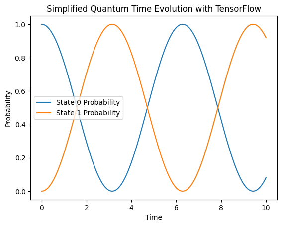

QuTiP is specifically designed for quantum physics simulations, leveraging quantum operators, states, and solvers like mcsolve for Monte Carlo simulations. TensorFlow, while powerful for numerical computations and especially optimized for machine learning tasks, does not natively support quantum physics concepts.
Therefore, a direct translation that runs "as-is" and gives the same plot output with equivalent time dynamics isn't straightforward. TensorFlow is generally meant for deep learning tasks; unlike QuTiP (Quantum Toolbox in Python), it is not explicitly made for quantum dynamics simulations, so implementing it in the code available in [ms_simulation_2level_system.ipynb](https://github.com/ubsuny/MC-CP2P2024/blob/main/mc_simulation_2level_system.ipynb) does not necessarily make it better. 

I tried applying the tensorflow approach  by implementing tensorflow quantum library within the python but it appeared like certain notations are not followed by qutip. Also there could be a drawback for this project to use tensorflow, because I have been using the latest python version, however, the tensorflow quantum is only supported on Python 3.7, 3.8, and 3.9[^1]. I tried to simulate the original code by changing the python version to 3.9, but it did not provided significant result and happened to encounter value-errors.


However, we can approximate certain aspects of the computation using TensorFlow, particularly matrix operations and differential equation solving. For a quantum simulation, we have to manually implement the dynamics (e.g., solving the Schrödinger equation) without the high-level abstractions QuTiP provides.

## Tensorflow:
Let's approach simulating a simplified version of quantum dynamics using TensorFlow. I will not implement tensorflow to the main code of the project, because it doesnot have any significant effect, rather use an example. The example won't fully replicate  QuTiP code's quantum behavior but will illustrate how to use TensorFlow for complex-valued matrix operations and basic time evolution.
The whole variety of initial states and operators, as well as certain characteristics unique to quantum mechanics, such as Monte Carlo wave function approaches, will not be included in this substantial simplification. 
```python
import tensorflow as tf
import numpy as np
import matplotlib.pyplot as plt

H = tf.constant([[1.0, 0.5], [0.5, 1.0]], dtype=tf.complex128)
psi0 = tf.constant([1.0, 0.0], dtype=tf.complex128)

def evolve(state, H, dt):
    U = tf.linalg.expm(-1j * H * dt)
    return tf.linalg.matvec(U, state)

times = np.linspace(0, 10, 200)
dt = times[1] - times[0]  # Time step

states = [psi0]

probs = [tf.abs(state)**2 for state in states]

plt.figure()
plt.plot(times, [prob[0].numpy() for prob in probs], label="State 0 Probability")
plt.plot(times, [prob[1].numpy() for prob in probs], label="State 1 Probability")
plt.title('Simplified Quantum Time Evolution with TensorFlow')
plt.xlabel('Time')
plt.ylabel('Probability')
plt.legend()
plt.show()
```
For this code, I have included the step documentation within the code file named as [tf_example.ipynb](https://github.com/ubsuny/MC-CP2P2024/blob/main/tf_example.ipynb).
- The quantum system's Hamiltonian is denoted by `H`. In this case, a TensorFlow constant is used to represent a 2x2 Hermitian matrix. The system's overall energy and motion are determined by the Hamiltonian.
- The initial state of the quantum system is denoted by `psi0`, which is represented as a column vector (ket) of length 2. Moreover, it is a TensorFlow constant. It depicts the beginning state in this instance as a superposition of the basis states.
- The `evolve` function defines the time evolution of the quantum state. It takes three arguments: the current state (state), the Hamiltonian (`H`), and the time step (`dt`). By multiplying the Hamiltonian matrix exponential by the imaginary unit `1j` and the time step `dt`, it calculates the unitary time evolution operator `U`. This is the basic principle of quantum mechanics that explains how time evolves of quantum states. The evolved state is then obtained by applying the unitary operator `U` to the present state.
- `times` is an array of 200 equally spaced points representing time values from 0 to 10. This indicates the desired time intervals for the quantum state calculation. The time step that separates successive time points in the times array is determined by `dt`.
- Every time point is iterated over by the loop. Using the evolve function, it determines the evolved state for each iteration and adds it to the states list.
- A list comprehension called `probs` determines the likelihood of existing in each state (0 and 1) at any given time. It determines each element of the quantum state vector (ket) by calculating its squared absolute value.

The result of this plot will look like:



## References:
[^1]: [Tensorflow Quantum](https://www.tensorflow.org/quantum/install)
